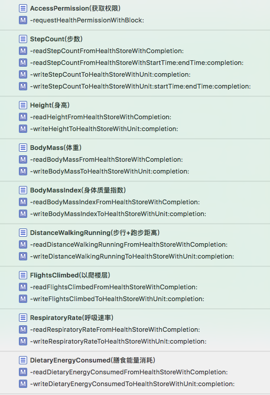
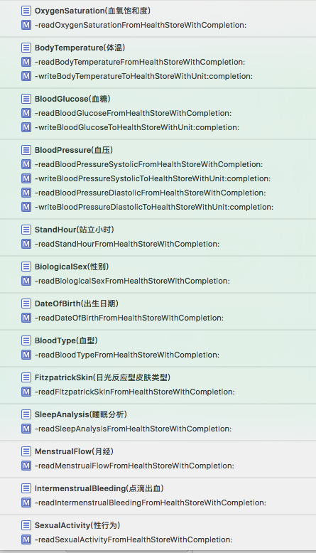

# skoal
&nbsp;
&nbsp;
&nbsp;
&nbsp;
&nbsp;
&nbsp;

## &emsp;&emsp;Skoal is a healthkit based library that supports reading and writing healthstore properties

## Supported Properties
|    Sample    |  HealthKit Identifier Type  |   Read   |   Write   |
|--------------|-----------------------------|----------|-----------|
|	StepCount	  | HKQuantityTypeIdentifierStepCount | ✓ | ✓ |
|	Height	  | HKQuantityTypeIdentifierHeight | ✓ | ✓ |
|	BodyMass	  | HKQuantityTypeIdentifierBodyMass | ✓ | ✓ ||
|	BodyMassIndex	  | HKQuantityTypeIdentifierBodyMassIndex | ✓ | ✓ |
|	DistanceWalkingRunning	| HKQuantityTypeIdentifierDistanceWalkingRunning | ✓ | ✓ |
|	FlightsClimbed  | HKQuantityTypeIdentifierFlightsClimbed | ✓ | ✓ |
|	RespiratoryRate	| HKQuantityTypeIdentifierRespiratoryRate | ✓ | ✓  |
|	DietaryEnergyConsumed  | HKQuantityTypeIdentifierDietaryEnergyConsumed | ✓ | ✓ |
|	OxygenSaturation	  | HKQuantityTypeIdentifierOxygenSaturation | ✓ |  |
|	BodyTemperature	  |	 HKQuantityTypeIdentifierBodyTemperature | ✓ | ✓ |
|	BloodGlucose	  | HKQuantityTypeIdentifierBloodGlucose | ✓ | ✓ |
|	BloodPressureSystolic  | HKQuantityTypeIdentifierBloodPressureSystolic | ✓ | ✓ |
|	BloodPressureDiastolic  | HKQuantityTypeIdentifierBloodPressureDiastolic | ✓ | ✓ |
|	StandHour	 | HKCategoryTypeIdentifierAppleStandHour | ✓ |  |
|	BiologicalSex	  | biologicalSexWithError | ✓ |  |
|	DateOfBirth	  |	 dateOfBirthComponentsWithError | ✓ |  |
|	BloodType	  |	 bloodTypeWithError | ✓ |  |
|	FitzpatrickSkin | fitzpatrickSkinTypeWithError | ✓ |  |
|	SleepAnalysis	  |	HKCategoryTypeIdentifierSleepAnalysis | ✓ |  |
|	MenstrualFlow	  | HKCategoryTypeIdentifierMenstrualFlow | ✓ |  |	
|	IntermenstrualBleeding  | HKCategoryTypeIdentifierIntermenstrualBleeding | ✓ |  |	
|	SexualActivity  | HKCategoryTypeIdentifierSexualActivity | ✓ |  |

## License
`skoal`use [__MIT license__][1]	

## Installation with cocoapods
<pre>
 pod 'skoal'
</pre>


## Usage
- [You should get HealthKit privacy permission before you use 'skoal'](#index1)
- [See the function by preview below](#index2)
- [Start the project to see the example](./skoal-example)

<a name='index1'></a>
- Objective-C
``` 
      [[skoal sharedInstance]requestHealthPermissionWithBlock:^(HealthStorePermissionResponse permissionResponse) {
            if (permissionResponse == HealthStorePermissionResponseError) {
                DLog(@"请求权限失败");
            }else{
                DLog(@"请求权限成功");
            }
        }];
```
- Swift
```
             skoal.sharedInstance().requestHealthPermission { (response: HealthStorePermissionResponse) in
                 if response == HealthStorePermissionResponse.error {
                     print("请求失败")
                 } else {
                     print("请求成功")
                }
			}
```
<a name='index2'></a>

func preview1  | func preview2
---------------|---------------
  |    


[1]: https://github.com/GREENBANYAN/skoal/blob/master/LICENSE "MIT License"
